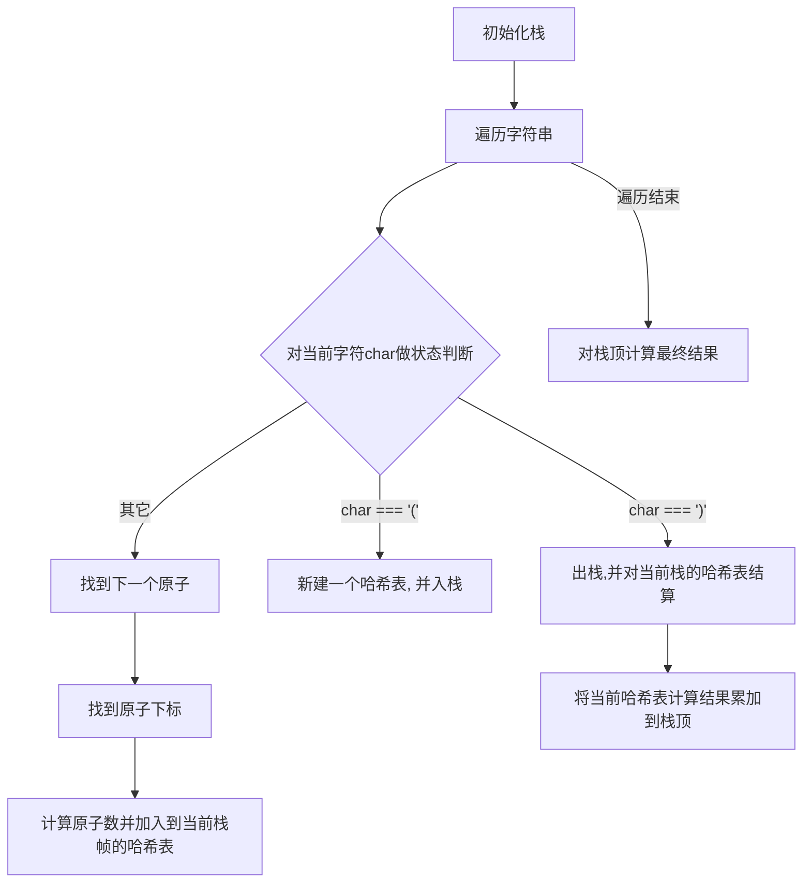

### 思路

每个括号内的计算都是一个子问题，对这种子问题可以通过迭代或者递归的方式处理

#### 迭代算法




```typescript
type StackFrame = Map<string, number>;

function countOfAtoms(formula: string): string {
  let point = 0;
  const stack: StackFrame[] = [];

  stack.unshift(new Map());

  function getAtom() {
    let result = formula[point++];
    while (point < formula.length && /[a-z]/.test(formula[point])) {
      result = result + formula[point];
      point++;
    }
    return result;
  }

  function getFactor() {
    let result = 0;
    while (point < formula.length && !isNaN(+formula[point])) {
      result = result * 10 + parseInt(formula[point], 10);
      point++;
    }
    return result || 1;
  }

  while (point < formula.length) {
    if (formula[point] === '(') {
      // 入栈
      stack.unshift(new Map());
      point++;
    } else if (formula[point] === ')') {
      // 出栈
      point++;
      const factor = getFactor();
      const curFrame = stack.shift();
      const topFrame = stack[0];

      for (const [atom, count] of curFrame.entries()) {
        const orginalCount = topFrame.get(atom) || 0;
        topFrame.set(atom, orginalCount + count * factor);
      }
    } else {
      // 对单原子处理
      const atom = getAtom();
      const factor = getFactor();

      stack[0].set(atom, (stack[0].get(atom) || 0) + factor);
    }
  }

  // 字典序排列
  const final = [...stack.shift()].sort();
  const result = [];
  for (let [atom, count] of final) {
    result.push(atom, count > 1 ? count : '');
  }
  return result.join('');
}

countOfAtoms('Mg(OH)2');

```
