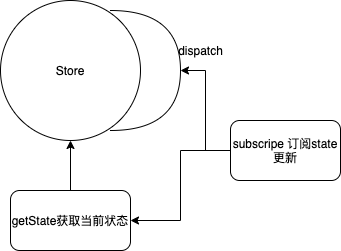
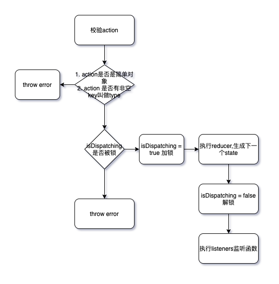
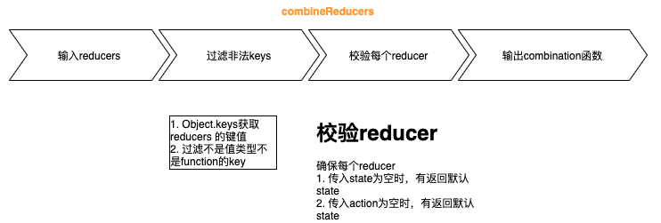
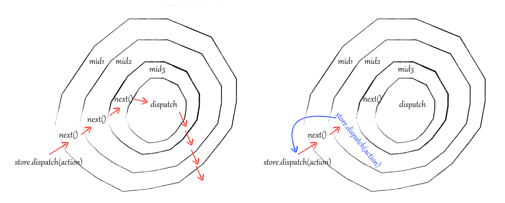

# redux 源码浅析

最近在把主力开发框架从 vue 转化到 react，对 redux 相关比较感兴趣，拉了 redux 的源码看了下，这里做下源码分析，方便有需要的同学取用。

什么是 redux，为什么用 redux，[官方文档](https://redux.js.org/)已经讲的非常清楚，这里就不再赘述。 这里主要关注 redux 的 src 部分。核心内容会分以下部分展开。

- createStore 做了什么
- combineReducers 做了什么
- redux 中间件实现

### 源码概览

以下是 redux 的核心源码，内容不多，结构也非常清晰。

```bash
src
├── applyMiddleware.ts
├── bindActionCreators.ts
├── combineReducers.ts
├── compose.ts
├── createStore.ts
├── index.ts														# 入口文件
├── types                               # 类型相关
│   ├── actions.ts
│   ├── middleware.ts
│   ├── reducers.ts
│   └── store.ts
└── utils																# 工具文件
    ├── actionTypes.ts
    ├── isPlainObject.ts
    ├── symbol-observable.ts
    └── warning.ts
```

其中 index.ts 主要暴露了以下 5 个 api 以及相关类型

- creatStore

- combineReducers

- bindActionCreators

- applyMiddleware

- compose

### 源码解读

#### createStore 做了什么

createStore 是一个工厂函数，生成管理状态树的 store, 接受三个参数，分别是

- **reducer**: 根据 action 生成下一个状态
- **preloadedState**: 初始化状态
- **enhancer**: 使用 applyMiddleware 返回的中间件增强

  先看 createStore 的函数定义，这里用 ts 的函数重载，表示 createStore 函数第一个参数必须是`reducer`, 第二个参数可以是初始化的 store 状态，也可以是中间件增强器，第三个参数必须是中间件增强器(如果有的话)，函数输出是一个 Store 类型。

```typescript
export default function createStore<
  S,
  A extends Action,
  Ext = {},
  StateExt = never
>(
  reducer: Reducer<S, A>,
  enhancer?: StoreEnhancer<Ext, StateExt>
): Store<ExtendState<S, StateExt>, A, StateExt, Ext> & Ext;
export default function createStore<
  S,
  A extends Action,
  Ext = {},
  StateExt = never
>(
  reducer: Reducer<S, A>,
  preloadedState?: PreloadedState<S>,
  enhancer?: StoreEnhancer<Ext, StateExt>
): Store<ExtendState<S, StateExt>, A, StateExt, Ext> & Ext;
export default function createStore<
  S,
  A extends Action,
  Ext = {},
  StateExt = never
>(
  reducer: Reducer<S, A>,
  preloadedState?: PreloadedState<S> | StoreEnhancer<Ext, StateExt>,
  enhancer?: StoreEnhancer<Ext, StateExt>
): Store<ExtendState<S, StateExt>, A, StateExt, Ext> & Ext {
  // ...
}
```

以下是 Store 类型的声明

```ts
export interface Store<
  S = any,
  A extends Action = AnyAction,
  StateExt = never,
  Ext = {}
> {
  // 调度器，唯一可以更改redux状态的入口，为了维护状态的原子性
  dispatch: Dispatch<A>;
  // 获取当前store的状态
  getState(): S;
  // 订阅状态改变
  subscribe(listener: () => void): Unsubscribe;
  // 更新reducers，可以用与做热更新或者分包
  replaceReducer<NewState, NewActions extends Action>(
    nextReducer: Reducer<NewState, NewActions>
  ): Store<ExtendState<NewState, StateExt>, NewActions, StateExt, Ext> & Ext;

  [Symbol.observable](): Observable<S>;
}
```

这里我画了一个简单的流程图看看 Store 是干什么的



看了 Store 的定义知道 Store 是干什么的，现在可以进入到 createStore 内部看看 Store 是怎么实现的。

createStore 内部定义了 currentReducer, currentState, currentListeners 表示当前 Store 的 reducer，状态以及监听函数，用 isDispatching 来加解锁保证状态的唯一性。其中的 currentListener 比较难理解，这里先略过。

```ts
let currentReducer = reducer;
let currentState = preloadedState as S;
let currentListeners: (() => void)[] | null = [];
let nextListeners = currentListeners;
let isDispatching = false;
```

##### getState

getState 没有什么好解读的，就是在 Store 被锁住的时候访问报错，否则返回 currentState

```typescript
/**
 * Reads the state tree managed by the store.
 *
 * @returns The current state tree of your application.
 */
function getState(): S {
  if (isDispatching) {
    throw new Error(
      'You may not call store.getState() while the reducer is executing. ' +
        'The reducer has already received the state as an argument. ' +
        'Pass it down from the top reducer instead of reading it from the store.'
    );
  }

  return currentState as S;
}
```

##### dispatch

dispatch 函数接受一个 action 作为参数，校验 action，校验成功后，将当前状态和 action 传入到 reducer 中生成下一个状态，并执行监听函数。其中 action 校验条件有

- action 必须是一个简单对象
- action 必须有一个叫做 type 的 key，且值非空

```ts
function dispatch(action: A) {
  if (!isPlainObject(action)) {
    throw new Error(
      'Actions must be plain objects. ' +
        'Use custom middleware for async actions.'
    );
  }

  if (typeof action.type === 'undefined') {
    throw new Error(
      'Actions may not have an undefined "type" property. ' +
        'Have you misspelled a constant?'
    );
  }

  if (isDispatching) {
    throw new Error('Reducers may not dispatch actions.');
  }

  try {
    isDispatching = true;
    currentState = currentReducer(currentState, action);
  } finally {
    isDispatching = false;
  }

  const listeners = (currentListeners = nextListeners);
  for (let i = 0; i < listeners.length; i++) {
    const listener = listeners[i];
    listener();
  }

  return action;
}
```

dispatch 的整体流程图如下


##### subscribe

```ts
function subscribe(listener: () => void) {
  if (typeof listener !== 'function') {
    throw new Error('Expected the listener to be a function.');
  }

  if (isDispatching) {
    throw new Error(
      'You may not call store.subscribe() while the reducer is executing. ' +
        'If you would like to be notified after the store has been updated, subscribe from a ' +
        'component and invoke store.getState() in the callback to access the latest state. ' +
        'See https://redux.js.org/api/store#subscribelistener for more details.'
    );
  }

  let isSubscribed = true;

  ensureCanMutateNextListeners();
  nextListeners.push(listener);

  return function unsubscribe() {
    if (!isSubscribed) {
      return;
    }

    if (isDispatching) {
      throw new Error(
        'You may not unsubscribe from a store listener while the reducer is executing. ' +
          'See https://redux.js.org/api/store#subscribelistener for more details.'
      );
    }

    isSubscribed = false;

    ensureCanMutateNextListeners();
    const index = nextListeners.indexOf(listener);
    nextListeners.splice(index, 1);
    currentListeners = null;
  };
}
```

#### subscribe

这里比较难以理解的是为什么有`currentListeners`和`nextListeners`, 这里用 nextListeners 是为了保证每次`dispatch`一个`action`的时候，订阅者都是一份快照。这样做的目的是为了避免在订阅过程中出现副作用，考虑下面的这种情况，都会代码来自单元测试，如果没有`nextListeners`, 所有的操作都是在`currentListeners`中进行，在通知订阅者更新的过程中订阅或者取订阅都破坏当前`listeners`的纯粹性。

```js
it('uses the last snapshot of subscribers during nested dispatch', () => {
  const store = createStore(reducers.todos);

  const listener1 = jest.fn();
  const listener2 = jest.fn();
  const listener3 = jest.fn();
  const listener4 = jest.fn();

  let unsubscribe4;
  const unsubscribe1 = store.subscribe(() => {
    listener1();
    expect(listener1.mock.calls.length).toBe(1);
    expect(listener2.mock.calls.length).toBe(0);
    expect(listener3.mock.calls.length).toBe(0);
    expect(listener4.mock.calls.length).toBe(0);

    unsubscribe1();
    unsubscribe4 = store.subscribe(listener4);
    store.dispatch(unknownAction());

    expect(listener1.mock.calls.length).toBe(1);
    expect(listener2.mock.calls.length).toBe(1);
    expect(listener3.mock.calls.length).toBe(1);
    expect(listener4.mock.calls.length).toBe(1);
  });
  store.subscribe(listener2);
  store.subscribe(listener3);

  store.dispatch(unknownAction());
  expect(listener1.mock.calls.length).toBe(1);
  expect(listener2.mock.calls.length).toBe(2);
  expect(listener3.mock.calls.length).toBe(2);
  expect(listener4.mock.calls.length).toBe(1);

  unsubscribe4();
  store.dispatch(unknownAction());
  expect(listener1.mock.calls.length).toBe(1);
  expect(listener2.mock.calls.length).toBe(3);
  expect(listener3.mock.calls.length).toBe(3);
  expect(listener4.mock.calls.length).toBe(1);
});
```

##### replaceReducer

replaceReducer 用于运行时原地替换当前的`reducer`, 和 vuex 的 module 有点类似, 主要应用场景有

- 代码分割，业务上代码被分割成不同模块，相应的状态也被分割成不同的部分，用`replaceReducer`实现`reducers`的动态更新
- 实现 reducers 的热更新

需要注意的时候 redux 触发了一个内部的`action: ActionTypes.REPLACE`, 这意味新的 reducers 被替换后会被立即执行，根据老的 state 执行新的 reducers 生成新的 state

```ts
/**
 * 输入: 新的reducers
 * 输出: 新的store
 *
 */
function replaceReducer<NewState, NewActions extends A>(
  nextReducer: Reducer<NewState, NewActions>
): Store<ExtendState<NewState, StateExt>, NewActions, StateExt, Ext> & Ext {
  if (typeof nextReducer !== 'function') {
    throw new Error('Expected the nextReducer to be a function.');
  }

  // TODO: do this more elegantly
  ((currentReducer as unknown) as Reducer<NewState, NewActions>) = nextReducer;

  // This action has a similar effect to ActionTypes.INIT.
  // Any reducers that existed in both the new and old rootReducer
  // will receive the previous state. This effectively populates
  // the new state tree with any relevant data from the old one.
  dispatch({ type: ActionTypes.REPLACE } as A);
  // change the type of the store by casting it to the new store
  return (store as unknown) as Store<
    ExtendState<NewState, StateExt>,
    NewActions,
    StateExt,
    Ext
  > &
    Ext;
}
```

##### observable

这个函数实现是为了适配 tc39 关于 observable 库的一个提案，目的是使用所有实现 Observable 的库中订阅 state 的变化，感兴趣的可以看下 [tc39 的提案](https://github.com/tc39/proposal-observable)

#### combineReducers 做了什么

combineReducers 的功能是将不同 reducers 聚合成一个大的 reducer。具体其做了以下事情。



#### bindActionCreators

`bindActionCreators` 函数接受一个 function 或者一个对象，根据传入值返回对应的内容，其核心功能是将`dispatch`函数绑定到 action

```ts
function bindActionCreator<A extends AnyAction = AnyAction>(
  actionCreator: ActionCreator<A>,
  dispatch: Dispatch
) {
  // 将dispatch函数绑定到 actionCreator
  return function (this: any, ...args: any[]) {
    return dispatch(actionCreator.apply(this, args));
  };
}

export default function bindActionCreators(
  actionCreators: ActionCreator<any> | ActionCreatorsMapObject,
  dispatch: Dispatch
) {
  // 传入为函数的情况
  if (typeof actionCreators === 'function') {
    return bindActionCreator(actionCreators, dispatch);
  }

  // ...

  // 传入为对象的情况
  const boundActionCreators: ActionCreatorsMapObject = {};
  for (const key in actionCreators) {
    const actionCreator = actionCreators[key];
    if (typeof actionCreator === 'function') {
      boundActionCreators[key] = bindActionCreator(actionCreator, dispatch);
    }
  }
  return boundActionCreators;
}
```

#### applyMiddleware

applyMiddleware 接受不限长度的 middleware 中间件，并返回一个函数`enhancer`，`enhancer`主要对 store 的 dispatch 函数进行封装。要看到`enhancer`函数的工作，首先得知道 redux 的中间件是怎么写的。

官方文档描述为

> 每个 middleware 接受 Store 的 dispatch 和 getState 函数作为命名参数，并返回一个函数。该函数会被传入被称为 next 的下一个 middleware 的 dispatch 方法，并返回一个接收 action 的新函数，这个函数可以直接调用 next(action)，或者在其他需要的时刻调用，甚至根本不去调用它。调用链中最后一个 middleware 会接受真实的 store 的 dispatch 方法作为 next 参数，并借此结束调用链。所以，middleware 的函数签名是 ({ getState, dispatch }) => next => action。

redux 中 Middleware ts 定义为

```ts
export interface MiddlewareAPI<D extends Dispatch = Dispatch, S = any> {
  dispatch: D;
  getState(): S;
}

export interface Middleware<
  _DispatchExt = {}, // TODO: remove unused component (breaking change)
  S = any,
  D extends Dispatch = Dispatch
> {
  (api: MiddlewareAPI<D, S>): (
    next: D
  ) => (action: D extends Dispatch<infer A> ? A : never) => any;
}
```

其中 next 可以理解为后续增强后的 dispatch 函数。applyMiddlewar 实现如下

```ts
export default function applyMiddleware(
  ...middlewares: Middleware[]
): StoreEnhancer<any> {
  return (createStore: StoreCreator) => <S, A extends AnyAction>(
    reducer: Reducer<S, A>,
    ...args: any[]
  ) => {
    const store = createStore(reducer, ...args);
    let dispatch: Dispatch = () => {
      throw new Error(
        'Dispatching while constructing your middleware is not allowed. ' +
          'Other middleware would not be applied to this dispatch.'
      );
    };

    // 定义一个 middlewareAPI，将getState 通过curry传入到中间件
    const middlewareAPI: MiddlewareAPI = {
      getState: store.getState,
      dispatch: (action, ...args) => dispatch(action, ...args),
    };
    // 通过compose函数将所有中间件串联
    const chain = middlewares.map((middleware) => middleware(middlewareAPI));
    dispatch = compose<typeof dispatch>(...chain)(store.dispatch);

    return {
      ...store,
      dispatch,
    };
  };
}
```

#### compose

redux 用 compose 函数将各个中间件以洋葱模型串联起来，代码如下


```ts
export default function compose(...funcs: Function[]) {
  if (funcs.length === 0) {
    // infer the argument type so it is usable in inference down the line
    return <T>(arg: T) => arg;
  }

  if (funcs.length === 1) {
    return funcs[0];
  }

  return funcs.reduce((a, b) => (...args: any) => a(b(...args)));
}
```

compose 函数应该是 redux 中最难理解的一块，`compose<typeof dispatch>(...chain)(store.dispatch)` 做的事实际是将各个中间件串联，并将 dispatch 柯里化到中间件内部。

### 总结

**Redux 试图让 state 的变化变得可预测**，为了做到这一点，redux 做了以下这些事

1. 全局只存在一个 store，state 存在 store 中
2. state 只能通过 action 改变，也就是说每次 state 的改变源头都是确定的
3. reducers 必须是纯函数，即在相同的输入值时，需产生相同的输出，当 action 确定时，reducers 输出的 state 也是确定的
4. 订阅 state 变化的 listener 每次被执行的都是当前快照，这样做的目的是为避免 listener 引入新的不确定性。

### 参考

[图解 Redux 中 middleware 的洋葱模型](https://juejin.im/post/5adec636518825670b33b7e8)

[reduce 与 redux 中 compose 函数](https://www.jianshu.com/p/c9dfe57c4a4e)
