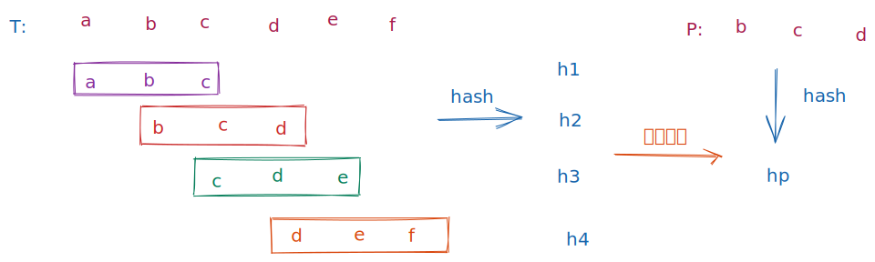

# 字符串匹配

字符串搜索算法（String searching algorithms）又称字符串比对算法（string matching algorithms）是一种搜索算法，是字符串算法中的一类，用以试图在一长字符串或文章中，找出其是否包含某一个或多个字符串，以及其位置。

用数学语言描述如下:

假设文本串 T 是一个长度为 n 的数组 $T[1..n]$, P 是长度为 m 的数组 $P[1..m]$, 其中 T 被称为文本串，P 被称为模式串。如果有 $0 <= s < m-n$, 使得 T[s, s + 1, .., s + m] 等于 P[1..m], 则称 P 在 T 中出现且位移为 s

字符串匹配问题就是找到模式串在文本串中的位移 s

<!-- 字符串匹配的概念 -->

## 暴力

遍历文本串，对遍历到的每个位置 i, 判断 $T[i..i+m]$ 是否和模式串$P[1..m]$相等
伪代码

```
n = length[T]
m = length[P]

for s = 0 to n - m
  do if T[s...s+m] == P[1...m]
    find s
```

时间复杂度 $O((n - m + 1) * n)$, 空间复杂度$O(1)$

这种暴力算法效率并不高，因为对于 s 的每个值，我们获得文本串和模式串的信息在考虑 s 的其它值时被丢弃了。比如 t = 'aaaabbbb', p = 'aabb'
当 s = 1 时，我们判断了 t[1] == p[1], t[2] == p[2], t[3] != p[3], s 递增判断 s=2 的情况，注意到在判断 s = 1 的时候，我们已经知道了 t[2] == p[2], 但是这个时候我们还要计算 t[2] 和 p[2]的比对情况，导致了计算重复。如果我们充分利用之前计算过的匹配信息，算法效率会有什么样的提升呢，接下来介绍另外几种算法。

## RK

RK 算法主要思想主要是对 T 中每个长度为 m 的子字符串 T[s..s+m] 做哈希，生成哈希值 h1, 对 P 做哈希，生成哈希值 h2, 比对 h1 和 h2，如果两个哈希值(不考虑冲突)相等，则判断 P 在 T 中出现，且位移为 s

伪代码

```
hp = hash(P[0..m])
for s = 0 to n - m
  hs = hash(T[s..s+m])
  if hp == hs
  then print 'find s'
```



我们这里选取的哈希函数为

$f(P[1..m]) = P[1..m]表示的10进制值$

假设 P 和 T 全由 d 个字符组成的，则我们可以选择 d 进制表示 P 和 T，再将 d 进制转为 10 进制便于计算。
为了简化说明，我们更特殊的假设 P 和 T 全由[0-9]10 个数字组成，
那么 P 的 10 进制为

```
f(P) = P[0] * 10 ^ (m - 1) + P[1] * 10 ^ (m - 2) ... + P[1]
```

T[s...s + m]的 10 进制为

```
f(T[s...s + m]) = T[s] * 10 ^ (m - 1) + T[s + 1] * 10 ^ (m - 2) ... + T[s + m]
```

T[s+1...s + m + 1] 可以根据 T[s...s + m]推导

```
f(T[s+1...s + m + 1]) = T[s+1] * 10 ^ (m - 1) + T[s + 2] * 10 ^ (m - 2) ... + T[s + m + 1]
= (f(T[s...s + m]) - T[s] * 10 ^ (m - 1)) * 10 + T[s + m + 1]
```

这样就把以上 `hp === hs` 的哈希比较转化为正常的 10 进制比较。

到目前为止，以上假设我们回避的一个问题是如果 f(P) 或者 f(T)计算的 10 进制过大，导致运算溢出怎么办？

这里我们通过选择一个比较大的素数 q, 计算后的 10 进制数对 q 取模后再进行比较。但是这种方案并不完美，f(P) % q === f(T[s]) % q 并不能代表 f(P) === f(T[s])。任何的 f(P) % q === f(T[s]) % q 都需要额外的测试来保证 P === T[s], 这里我们通过检测 P[1...m] === T[s...s+m]来完成。

## KMP
